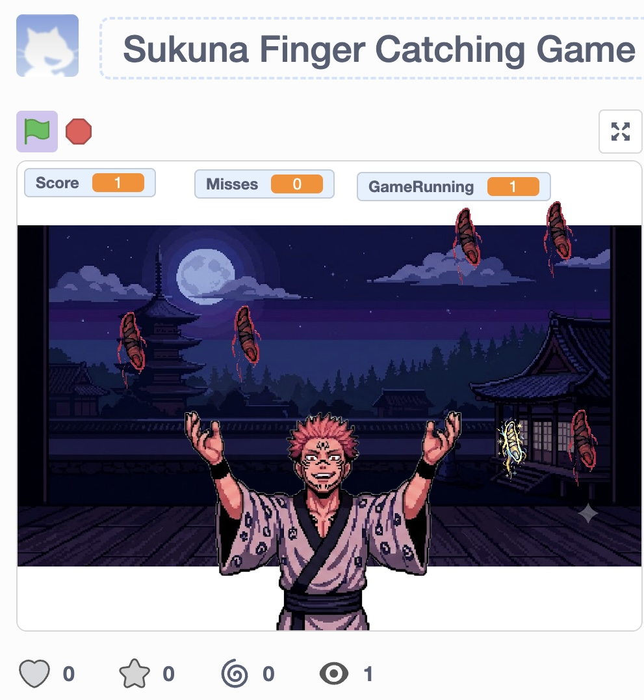
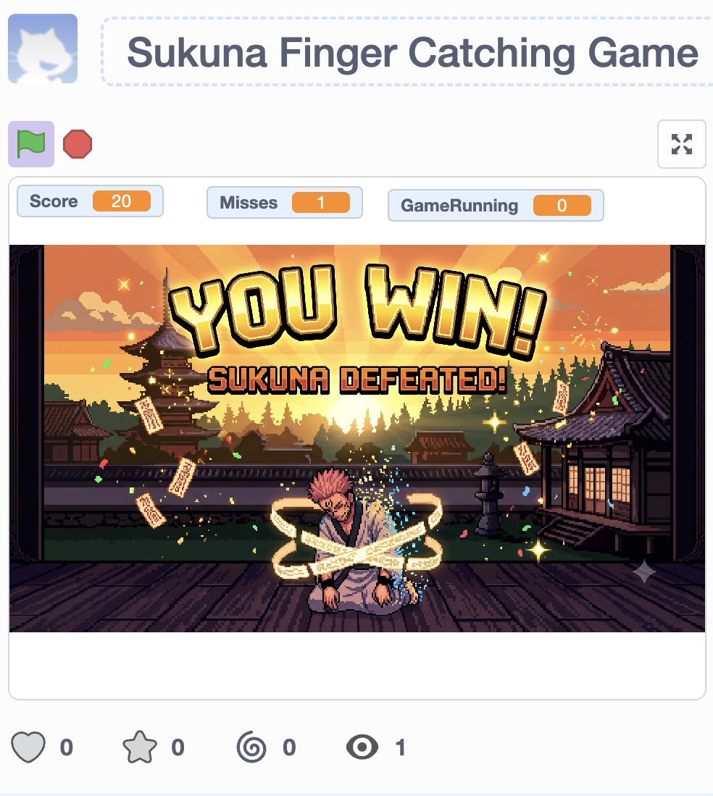
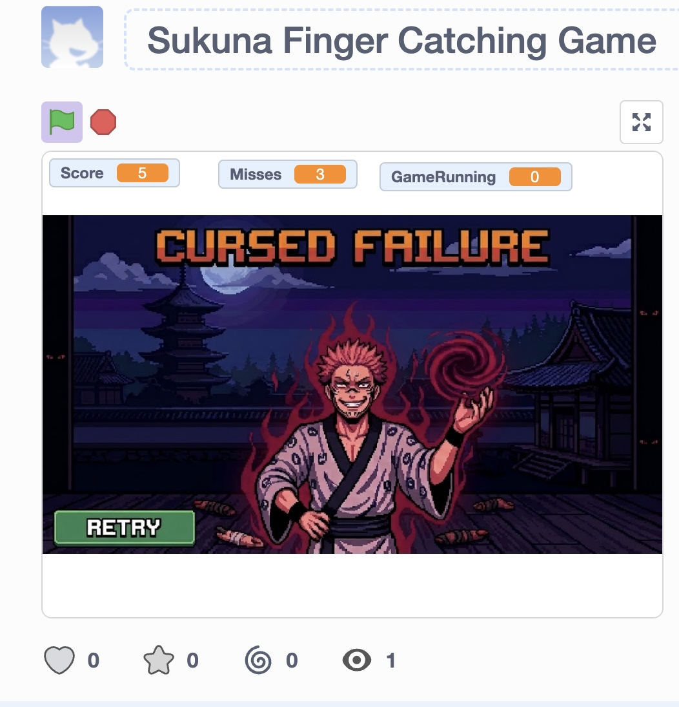

# Sukuna Finger Catching Game

## Overview

Sukuna Finger Catching Game is an interactive game I developed using Scratch 3.0 while learning the fundamentals of programming through Harvard's CS50 Introduction to Programming with Scratch course.

Inspired by the anime *Jujutsu Kaisen*, the game features Sukuna as the main character. Players control Sukuna to collect falling fingers while avoiding missed objects. The game includes a collection system, progress tracking, and separate victory and game-over screens.

I developed this project to apply programming concepts such as variables, loops, conditional statements, events, broadcasts, and custom blocks. It also gave me practical experience designing game mechanics, debugging scripts, and coordinating interactions between different sprites.

## Technologies Used

- **Scratch 3.0:** Visual programming environment used to develop the game.
- **Block-Based Programming:** Used to implement character movement, object interactions, and game logic.
- **Event-Driven Programming:** Used to coordinate interactions between sprites and different game states.

## Key Features

- **Character Movement:** Players control Sukuna to collect falling fingers.
- **Collectible Objects:** Fingers appear during gameplay and can be collected.
- **Progress Tracking:** Variables track collected and missed fingers.
- **Victory Condition:** A victory screen appears when the player reaches the collection goal.
- **Game-Over Condition:** Missing three fingers ends the game.
- **Multiple Backdrops:** Separate backdrops are used for gameplay, victory, and game over.
- **Broadcast Messages:** Coordinate transitions between different game states.
- **Cloning:** Allows game objects to be created during gameplay.
- **Custom Blocks:** Help organize instructions into reusable sections.

## Gameplay Screenshots

### Main Gameplay

The main gameplay screen shows Sukuna collecting falling fingers.

### Victory Screen

The victory screen appears when the player successfully completes the collection objective.

### Game-Over Screen

The game-over screen appears when the player misses three fingers.

## How to Play

1. Open the project in Scratch.
2. Click the green flag to start the game.
3. Control Sukuna to collect the falling fingers.
4. Collect the required number of fingers to win.
5. Avoid missing three fingers, which triggers the game-over screen.
6. Click the green flag to restart the game.

## Programming Concepts Used

### Events and Broadcast Messages

The game uses Scratch events to start gameplay and broadcast messages to communicate between different sprites.

These messages help coordinate the transitions between gameplay, victory, and game-over screens.

### Variables

Variables store and update information about the player's progress, including the number of fingers collected and missed.

### Loops

Loops allow instructions to run repeatedly during gameplay, supporting continuous game behavior and object interactions.

### Conditional Statements

Conditional statements check whether objects have been collected or missed and determine when the game should end.

### Cloning

Cloning allows additional instances of game objects to appear without manually creating separate sprites for each instance.

### Custom Blocks

Custom blocks organize related instructions into reusable sections, making the project easier to understand and maintain.

## How to Run the Project

1. Download the `Sukuna Finger Catching Game.sb3` file from this repository.
2. Visit the [Scratch Editor](https://scratch.mit.edu/projects/editor/).
3. Select **File → Load from your computer**.
4. Choose the downloaded `.sb3` file.
5. Click the green flag to start playing.

The project runs in Scratch and does not require additional Python libraries or software installation.

## Development Process

I began by planning the game's basic mechanics and deciding how the player would interact with falling objects.

I then implemented Sukuna's movement and the finger-collection system. After creating the basic gameplay, I added variables to track progress and conditional statements to determine when the player should win or lose.

One of the main challenges I encountered was coordinating Sukuna's visibility with different game states. During development, the character initially remained visible after the game ended. After adjusting the scripts, I encountered another issue where Sukuna did not reappear correctly when restarting.

I worked through these problems by reviewing the relevant events, checking the character's scripts, and testing different conditions until the transitions worked as intended.

This debugging process helped me better understand how multiple scripts interact in an event-driven program.

## What I Learned

Developing this project helped me strengthen my understanding of programming fundamentals and apply them to an interactive game.

Through this project, I gained experience in:

- Using variables to track and update game information.
- Applying loops and conditional statements to control gameplay.
- Coordinating multiple sprites using events and broadcasts.
- Working with clones and custom blocks.
- Implementing victory and game-over conditions.
- Debugging issues involving sprite visibility and game-state transitions.

The project also taught me the importance of testing individual components and understanding how changes in one script can affect the behavior of other parts of the game.

## Future Improvements

As I continue learning programming and game development, I would like to improve the game by:

- Introducing multiple difficulty levels.
- Adding new collectible objects and obstacles.
- Improving character animations and visual effects.
- Adding background music and sound effects.
- Creating a start menu with gameplay instructions.
- Introducing additional challenges as the player progresses.

## Disclaimer

This is a fan-made educational project inspired by *Jujutsu Kaisen*. It was created for programming practice and is not affiliated with or endorsed by the creators or rights holders of the series.

## Author

**Veer Sinha**

Developed as part of my programming practice while studying Harvard's CS50 Introduction to Programming with Scratch.
